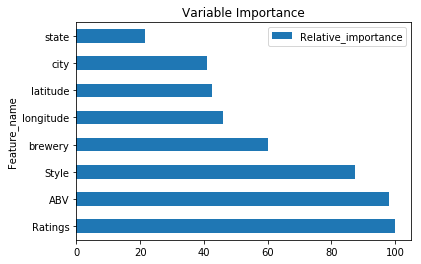

# Beer Modeling

In this part of the analysis we will be using our exploratory analysis we did in the last part to model. This model will help us see what features in the data set have the biggest effect on making a prediciton. We will be using a gradient boosting regressor to predict the score of a beer.


```python
import pandas as pd
import numpy as np
import matplotlib.pyplot as mpl
import sklearn.preprocessing as prp
from sklearn.model_selection import train_test_split
from sklearn.ensemble import GradientBoostingRegressor
from sklearn.model_selection import cross_val_score
from sklearn.model_selection import LeaveOneOut
from sklearn.svm import SVR
from sklearn.preprocessing import MinMaxScaler
from IPython.display import clear_output
from sklearn.metrics import mean_squared_error
```


```python
beer = pd.read_csv('~/documents/data/beer/data/final_beer_data.csv')
beer[['ABV', 'Score']] = beer.replace('?', 0)[['ABV', 'Score']].astype(np.float64)
print(beer.keys())
```

    Index(['Name', 'Style', 'ABV', 'Ratings', 'Score', 'brewery', 'website',
           'country', 'state', 'city', 'brewery_new', 'latitude', 'longitude',
           'accuracy', 'location'],
          dtype='object')


In the cell above we can see the features we will be using to predict. The independent variables will be the beer style, alcohol percentage, number ratings, brewery name, state, city, latitude, and longitude. The dependent variable will be the beer score.


```python
beer.head()
```


<div>
<style scoped>
    .dataframe tbody tr th:only-of-type {
        vertical-align: middle;
    }

    .dataframe tbody tr th {
        vertical-align: top;
    }

    .dataframe thead th {
        text-align: right;
    }
</style>
<table border="1" class="dataframe">
  <thead>
    <tr style="text-align: right;">
      <th></th>
      <th>Name</th>
      <th>Style</th>
      <th>ABV</th>
      <th>Ratings</th>
      <th>Score</th>
      <th>brewery</th>
      <th>website</th>
      <th>country</th>
      <th>state</th>
      <th>city</th>
      <th>brewery_new</th>
      <th>latitude</th>
      <th>longitude</th>
      <th>accuracy</th>
      <th>location</th>
    </tr>
  </thead>
  <tbody>
    <tr>
      <th>0</th>
      <td>(512) ALT</td>
      <td>Altbier</td>
      <td>6.0</td>
      <td>57</td>
      <td>3.73</td>
      <td>512 Brewing Company</td>
      <td>http://512brewing.com/</td>
      <td>United States</td>
      <td>Texas</td>
      <td>Austin</td>
      <td>512 Brewing Company</td>
      <td>30.2234</td>
      <td>-97.7697</td>
      <td>ROOFTOP</td>
      <td>POINT(-97.7697 30.2234)</td>
    </tr>
    <tr>
      <th>1</th>
      <td>(512) Black IPA</td>
      <td>American Black Ale</td>
      <td>7.5</td>
      <td>103</td>
      <td>3.94</td>
      <td>512 Brewing Company</td>
      <td>http://512brewing.com/</td>
      <td>United States</td>
      <td>Texas</td>
      <td>Austin</td>
      <td>512 Brewing Company</td>
      <td>30.2234</td>
      <td>-97.7697</td>
      <td>ROOFTOP</td>
      <td>POINT(-97.7697 30.2234)</td>
    </tr>
    <tr>
      <th>2</th>
      <td>(512) Brett Stingo</td>
      <td>American Wild Ale</td>
      <td>7.0</td>
      <td>1</td>
      <td>3.97</td>
      <td>512 Brewing Company</td>
      <td>http://512brewing.com/</td>
      <td>United States</td>
      <td>Texas</td>
      <td>Austin</td>
      <td>512 Brewing Company</td>
      <td>30.2234</td>
      <td>-97.7697</td>
      <td>ROOFTOP</td>
      <td>POINT(-97.7697 30.2234)</td>
    </tr>
    <tr>
      <th>3</th>
      <td>(512) Bruin</td>
      <td>American Brown Ale</td>
      <td>7.6</td>
      <td>102</td>
      <td>3.89</td>
      <td>512 Brewing Company</td>
      <td>http://512brewing.com/</td>
      <td>United States</td>
      <td>Texas</td>
      <td>Austin</td>
      <td>512 Brewing Company</td>
      <td>30.2234</td>
      <td>-97.7697</td>
      <td>ROOFTOP</td>
      <td>POINT(-97.7697 30.2234)</td>
    </tr>
    <tr>
      <th>4</th>
      <td>(512) Cab Tripel</td>
      <td>Tripel</td>
      <td>9.5</td>
      <td>21</td>
      <td>3.83</td>
      <td>512 Brewing Company</td>
      <td>http://512brewing.com/</td>
      <td>United States</td>
      <td>Texas</td>
      <td>Austin</td>
      <td>512 Brewing Company</td>
      <td>30.2234</td>
      <td>-97.7697</td>
      <td>ROOFTOP</td>
      <td>POINT(-97.7697 30.2234)</td>
    </tr>
  </tbody>
</table>
</div>


If we look at the output above we can see that the values are all integers. We will need to preprocess this data so that it will work in the model. The columns we will have to encode are 'Style', 'brewery', 'state', 'city', 'brewery_new'.


```python
colnames = ['Style', 'brewery', 'state', 'city', 'brewery_new']
for col in colnames: 
    mask = ~beer[col].isnull()
    beer[col][mask] = prp.LabelEncoder().fit_transform(beer[col][mask])
    beer[col].fillna(0, inplace = True)
```

    /Library/Frameworks/Python.framework/Versions/3.7/lib/python3.7/site-packages/ipykernel_launcher.py:4: SettingWithCopyWarning: 
    A value is trying to be set on a copy of a slice from a DataFrame
    
    See the caveats in the documentation: http://pandas.pydata.org/pandas-docs/stable/indexing.html#indexing-view-versus-copy
      after removing the cwd from sys.path.


Now lets create our training and testing data.


```python
y = beer['Score']
x = beer[['ABV', 'Style', 'Ratings', 'brewery', 'state', 'city', 'latitude', 'longitude']]
X_train, X_test, y_train, y_test = train_test_split(x, y, random_state = 0)

X_train_scale = MinMaxScaler().fit_transform(X_train)
X_test_scale = MinMaxScaler().fit_transform(X_test)

X_train_sub, X_val, y_train_sub, y_val = train_test_split(X_train_scale, y_train, random_state = 0 )
```

With our training and testing data set up lets run the model and return a score to see how accurate the model can be.


```python
clf = GradientBoostingRegressor()
clf.fit(X_train, y_train)
clf.score(X_test, y_test).round(3)
```


    0.839


With the default parameters we get an accuracy of about 84% lets use a grid search to optimize the model

```python
learning_rates = [0.05, 0.1, 0.25, 0.5, 0.75, 1]
num_estimators = [80, 100, 120, 150, 170]
max_depths = [2, 3, 4, 5, 6, 7, 8]
```


```python
best_score = 0
best_abs = 1
for rate in learning_rates:
    for num in num_estimators:
        for depth in max_depths:
            clf = GradientBoostingRegressor(learning_rate = rate, n_estimators = num, max_depth = depth, random_state = 0)
            clf.fit(X_train_scale, y_train)
            score = clf.score(X_train_scale, y_train)
            score_val = clf.score(X_val, y_val)
            score_abs = abs(score - score_val)
            if (score_val > best_score) and (score_abs < best_abs):
                best_score = score_val
                best_abs = score_abs
                best_rate = rate
                best_num = num
                best_depth = depth
                  
            print('learning_rate: ' + str(rate))
            print('num_estimators: ' + str(num))
            print('max_depth: ' + str(depth))
            print('score(training): ' + str(score))
            print('score(validation): ' + str(score_val))
            print()
```

    learning_rate: 0.05
    num_estimators: 80
    max_depth: 2
    score(training): 0.8060053328331398
    score(validation): 0.8046200879054912
    
    learning_rate: 0.05
    num_estimators: 80
    max_depth: 3
    score(training): 0.8207121455829229
    score(validation): 0.8181466959237087
    
    learning_rate: 0.05
    num_estimators: 80
    max_depth: 4
    score(training): 0.8320607330486258
    score(validation): 0.8298435565756106
    
    learning_rate: 0.05
    num_estimators: 80
    max_depth: 5
    score(training): 0.8450580572531069
    score(validation): 0.8432186755724962
    
    learning_rate: 0.05
    num_estimators: 80
    max_depth: 6
    score(training): 0.8558602519514952
    score(validation): 0.8541158281470249
    
    learning_rate: 0.05
    num_estimators: 80
    max_depth: 7
    score(training): 0.8667030212955292
    score(validation): 0.8654854000441154
    
    learning_rate: 0.05
    num_estimators: 80
    max_depth: 8
    score(training): 0.877912949548258
    score(validation): 0.8770302652482239
    
    learning_rate: 0.05
    num_estimators: 100
    max_depth: 2
    score(training): 0.8123548320586447
    score(validation): 0.8106671286014783
    
    learning_rate: 0.05
    num_estimators: 100
    max_depth: 3
    score(training): 0.8278743126395061
    score(validation): 0.8252698248932407
    
    learning_rate: 0.05
    num_estimators: 100
    max_depth: 4
    score(training): 0.83847116257419
    score(validation): 0.8363589124068997
    
    learning_rate: 0.05
    num_estimators: 100
    max_depth: 5
    score(training): 0.8507879132453804
    score(validation): 0.848753902809179
    
    learning_rate: 0.05
    num_estimators: 100
    max_depth: 6
    score(training): 0.8605125062328154
    score(validation): 0.8589012474781312
    
    learning_rate: 0.05
    num_estimators: 100
    max_depth: 7
    score(training): 0.8717030380855514
    score(validation): 0.870456503363386
    
    learning_rate: 0.05
    num_estimators: 100
    max_depth: 8
    score(training): 0.8832370464321271
    score(validation): 0.8824835860495239
    
    learning_rate: 0.05
    num_estimators: 120
    max_depth: 2
    score(training): 0.8179582026608413
    score(validation): 0.816129573662389
    
    learning_rate: 0.05
    num_estimators: 120
    max_depth: 3
    score(training): 0.8319401875916426
    score(validation): 0.829329644578916
    
    learning_rate: 0.05
    num_estimators: 120
    max_depth: 4
    score(training): 0.8429325741841298
    score(validation): 0.8407902462845774
    
    learning_rate: 0.05
    num_estimators: 120
    max_depth: 5
    score(training): 0.854954438878255
    score(validation): 0.8528305812205684
    
    learning_rate: 0.05
    num_estimators: 120
    max_depth: 6
    score(training): 0.8656286745143738
    score(validation): 0.8643396763082614
    
    learning_rate: 0.05
    num_estimators: 120
    max_depth: 7
    score(training): 0.8763336463524041
    score(validation): 0.8752565382985229
    
    learning_rate: 0.05
    num_estimators: 120
    max_depth: 8
    score(training): 0.8879990118302372
    score(validation): 0.8873315185391409
    
    learning_rate: 0.05
    num_estimators: 150
    max_depth: 2
    score(training): 0.8239132390914253
    score(validation): 0.8217052170315859
    
    learning_rate: 0.05
    num_estimators: 150
    max_depth: 3
    score(training): 0.8371687796300559
    score(validation): 0.834522523099012
    
    learning_rate: 0.05
    num_estimators: 150
    max_depth: 4
    score(training): 0.8481109090811674
    score(validation): 0.8459428226941352
    
    learning_rate: 0.05
    num_estimators: 150
    max_depth: 5
    score(training): 0.8595066554951689
    score(validation): 0.8573243159592651
    
    learning_rate: 0.05
    num_estimators: 150
    max_depth: 6
    score(training): 0.8720811877359055
    score(validation): 0.8706025622100582
    
    learning_rate: 0.05
    num_estimators: 150
    max_depth: 7
    score(training): 0.8839978557709872
    score(validation): 0.8828615325121549
    
    learning_rate: 0.05
    num_estimators: 150
    max_depth: 8
    score(training): 0.8947861332042569
    score(validation): 0.8940824848605212
    
    learning_rate: 0.05
    num_estimators: 170
    max_depth: 2
    score(training): 0.8268887262161886
    score(validation): 0.8244075943699736
    
    learning_rate: 0.05
    num_estimators: 170
    max_depth: 3
    score(training): 0.8397437503268551
    score(validation): 0.8371196846818616
    
    learning_rate: 0.05
    num_estimators: 170
    max_depth: 4
    score(training): 0.8508694231730108
    score(validation): 0.8486465250352638
    
    learning_rate: 0.05
    num_estimators: 170
    max_depth: 5
    score(training): 0.863336086586147
    score(validation): 0.8609752856733178
    
    learning_rate: 0.05
    num_estimators: 170
    max_depth: 6
    score(training): 0.8754134394376499
    score(validation): 0.8738328106363628
    
    learning_rate: 0.05
    num_estimators: 170
    max_depth: 7
    score(training): 0.887908176185304
    score(validation): 0.8868096035792459
    
    learning_rate: 0.05
    num_estimators: 170
    max_depth: 8
    score(training): 0.900086011270907
    score(validation): 0.8994123709469182
    
    learning_rate: 0.1
    num_estimators: 80
    max_depth: 2
    score(training): 0.8254668581444912
    score(validation): 0.8232632082745466
    
    learning_rate: 0.1
    num_estimators: 80
    max_depth: 3
    score(training): 0.8390038702937921
    score(validation): 0.8363971434163514
    
    learning_rate: 0.1
    num_estimators: 80
    max_depth: 4
    score(training): 0.8499617083797434
    score(validation): 0.847647705684718
    
    learning_rate: 0.1
    num_estimators: 80
    max_depth: 5
    score(training): 0.8626414152074002
    score(validation): 0.8610350983996525
    
    learning_rate: 0.1
    num_estimators: 80
    max_depth: 6
    score(training): 0.8735975059174517
    score(validation): 0.8718353934011284
    
    learning_rate: 0.1
    num_estimators: 80
    max_depth: 7
    score(training): 0.8870393478951171
    score(validation): 0.8860986083718732
    
    learning_rate: 0.1
    num_estimators: 80
    max_depth: 8
    score(training): 0.898879284716105
    score(validation): 0.8981473566188327
    
    learning_rate: 0.1
    num_estimators: 100
    max_depth: 2
    score(training): 0.8303890565419912
    score(validation): 0.8279265705532063
    
    learning_rate: 0.1
    num_estimators: 100
    max_depth: 3
    score(training): 0.8432205419561473
    score(validation): 0.8406350230071086
    
    learning_rate: 0.1
    num_estimators: 100
    max_depth: 4
    score(training): 0.8556473735581638
    score(validation): 0.8532556612328144
    
    learning_rate: 0.1
    num_estimators: 100
    max_depth: 5
    score(training): 0.8684892140576058
    score(validation): 0.866819065261057
    
    learning_rate: 0.1
    num_estimators: 100
    max_depth: 6
    score(training): 0.8794830865823388
    score(validation): 0.8777910767374473
    
    learning_rate: 0.1
    num_estimators: 100
    max_depth: 7
    score(training): 0.8932937927928638
    score(validation): 0.89269594096756
    
    learning_rate: 0.1
    num_estimators: 100
    max_depth: 8
    score(training): 0.9078649208270815
    score(validation): 0.9077374646754799
    
    learning_rate: 0.1
    num_estimators: 120
    max_depth: 2
    score(training): 0.8339206256082667
    score(validation): 0.8312188380090425
    
    learning_rate: 0.1
    num_estimators: 120
    max_depth: 3
    score(training): 0.8475341652151976
    score(validation): 0.8447748621065546
    
    learning_rate: 0.1
    num_estimators: 120
    max_depth: 4
    score(training): 0.8597429867279075
    score(validation): 0.8571975830731109
    
    learning_rate: 0.1
    num_estimators: 120
    max_depth: 5
    score(training): 0.8725556498476406
    score(validation): 0.8711373243612937
    
    learning_rate: 0.1
    num_estimators: 120
    max_depth: 6
    score(training): 0.8845250963233943
    score(validation): 0.8831448126810438
    
    learning_rate: 0.1
    num_estimators: 120
    max_depth: 7
    score(training): 0.8991769899341208
    score(validation): 0.8983876339586263
    
    learning_rate: 0.1
    num_estimators: 120
    max_depth: 8
    score(training): 0.9125410909881464
    score(validation): 0.9122586579763788
    
    learning_rate: 0.1
    num_estimators: 150
    max_depth: 2
    score(training): 0.8377788050303576
    score(validation): 0.8351289154442563
    
    learning_rate: 0.1
    num_estimators: 150
    max_depth: 3
    score(training): 0.8521422243122104
    score(validation): 0.8493287071445831
    
    learning_rate: 0.1
    num_estimators: 150
    max_depth: 4
    score(training): 0.8661059738866782
    score(validation): 0.8639150799970994
    
    learning_rate: 0.1
    num_estimators: 150
    max_depth: 5
    score(training): 0.877688605714535
    score(validation): 0.8761880408364457
    
    learning_rate: 0.1
    num_estimators: 150
    max_depth: 6
    score(training): 0.8909600426698916
    score(validation): 0.8895852354179409
    
    learning_rate: 0.1
    num_estimators: 150
    max_depth: 7
    score(training): 0.9047509350975524
    score(validation): 0.9036372086906572
    
    learning_rate: 0.1
    num_estimators: 150
    max_depth: 8
    score(training): 0.919734672201135
    score(validation): 0.9194717860077738
    
    learning_rate: 0.1
    num_estimators: 170
    max_depth: 2
    score(training): 0.8398412630574827
    score(validation): 0.8371684090990673
    
    learning_rate: 0.1
    num_estimators: 170
    max_depth: 3
    score(training): 0.855467693207578
    score(validation): 0.8527279127579555
    
    learning_rate: 0.1
    num_estimators: 170
    max_depth: 4
    score(training): 0.8691354659752422
    score(validation): 0.8673433515950343
    
    learning_rate: 0.1
    num_estimators: 170
    max_depth: 5
    score(training): 0.8804246547920883
    score(validation): 0.8790600775106483
    
    learning_rate: 0.1
    num_estimators: 170
    max_depth: 6
    score(training): 0.8937389425001406
    score(validation): 0.8919731515370447
    
    learning_rate: 0.1
    num_estimators: 170
    max_depth: 7
    score(training): 0.9084298354511298
    score(validation): 0.9072373184094712
    
    learning_rate: 0.1
    num_estimators: 170
    max_depth: 8
    score(training): 0.9247642634618588
    score(validation): 0.924239904351156
    
    learning_rate: 0.25
    num_estimators: 80
    max_depth: 2
    score(training): 0.8456239195392459
    score(validation): 0.8431481160868342
    
    learning_rate: 0.25
    num_estimators: 80
    max_depth: 3
    score(training): 0.8609635955244295
    score(validation): 0.858653074025289
    
    learning_rate: 0.25
    num_estimators: 80
    max_depth: 4
    score(training): 0.8731492269658451
    score(validation): 0.8718248513266326
    
    learning_rate: 0.25
    num_estimators: 80
    max_depth: 5
    score(training): 0.8863372661336447
    score(validation): 0.8852570591583683
    
    learning_rate: 0.25
    num_estimators: 80
    max_depth: 6
    score(training): 0.9003515590131189
    score(validation): 0.8983729016804309
    
    learning_rate: 0.25
    num_estimators: 80
    max_depth: 7
    score(training): 0.9149999367601217
    score(validation): 0.9121542890418927
    
    learning_rate: 0.25
    num_estimators: 80
    max_depth: 8
    score(training): 0.9316168811160666
    score(validation): 0.9308859006758945
    
    learning_rate: 0.25
    num_estimators: 100
    max_depth: 2
    score(training): 0.8490844683936931
    score(validation): 0.8471727177395179
    
    learning_rate: 0.25
    num_estimators: 100
    max_depth: 3
    score(training): 0.8648081625729934
    score(validation): 0.8625307099665389
    
    learning_rate: 0.25
    num_estimators: 100
    max_depth: 4
    score(training): 0.8783873873338729
    score(validation): 0.8767783952588304
    
    learning_rate: 0.25
    num_estimators: 100
    max_depth: 5
    score(training): 0.8912516392821962
    score(validation): 0.8898380395026099
    
    learning_rate: 0.25
    num_estimators: 100
    max_depth: 6
    score(training): 0.9063653763612848
    score(validation): 0.9047457994762973
    
    learning_rate: 0.25
    num_estimators: 100
    max_depth: 7
    score(training): 0.9217989673724071
    score(validation): 0.9198329102850473
    
    learning_rate: 0.25
    num_estimators: 100
    max_depth: 8
    score(training): 0.9383231220363202
    score(validation): 0.9374147056290696
    
    learning_rate: 0.25
    num_estimators: 120
    max_depth: 2
    score(training): 0.8525828816512473
    score(validation): 0.8505427431037033
    
    learning_rate: 0.25
    num_estimators: 120
    max_depth: 3
    score(training): 0.8683208090761664
    score(validation): 0.8660360654485884
    
    learning_rate: 0.25
    num_estimators: 120
    max_depth: 4
    score(training): 0.8822638917116216
    score(validation): 0.8809578717256372
    
    learning_rate: 0.25
    num_estimators: 120
    max_depth: 5
    score(training): 0.8959214014134931
    score(validation): 0.8947057955470082
    
    learning_rate: 0.25
    num_estimators: 120
    max_depth: 6
    score(training): 0.911258578156703
    score(validation): 0.9096415179237977
    
    learning_rate: 0.25
    num_estimators: 120
    max_depth: 7
    score(training): 0.9280994178996672
    score(validation): 0.9264694199934856
    
    learning_rate: 0.25
    num_estimators: 120
    max_depth: 8
    score(training): 0.943582175618503
    score(validation): 0.9427500131775527
    
    learning_rate: 0.25
    num_estimators: 150
    max_depth: 2
    score(training): 0.8562291172988046
    score(validation): 0.8543064565747425
    
    learning_rate: 0.25
    num_estimators: 150
    max_depth: 3
    score(training): 0.8726680115252465
    score(validation): 0.8702754975895657
    
    learning_rate: 0.25
    num_estimators: 150
    max_depth: 4
    score(training): 0.8871174116787113
    score(validation): 0.8861965177997854
    
    learning_rate: 0.25
    num_estimators: 150
    max_depth: 5
    score(training): 0.9011326123406845
    score(validation): 0.8999200015934521
    
    learning_rate: 0.25
    num_estimators: 150
    max_depth: 6
    score(training): 0.9173135634598127
    score(validation): 0.9156550079630718
    
    learning_rate: 0.25
    num_estimators: 150
    max_depth: 7
    score(training): 0.9360007394291913
    score(validation): 0.9345841451154175
    
    learning_rate: 0.25
    num_estimators: 150
    max_depth: 8
    score(training): 0.9526380670011542
    score(validation): 0.9524051058678652
    
    learning_rate: 0.25
    num_estimators: 170
    max_depth: 2
    score(training): 0.8581902118794247
    score(validation): 0.8562173519929188
    
    learning_rate: 0.25
    num_estimators: 170
    max_depth: 3
    score(training): 0.8745227229283146
    score(validation): 0.8721792098406758
    
    learning_rate: 0.25
    num_estimators: 170
    max_depth: 4
    score(training): 0.8894068158060705
    score(validation): 0.8887301163697708
    
    learning_rate: 0.25
    num_estimators: 170
    max_depth: 5
    score(training): 0.9042898100645725
    score(validation): 0.9029844459240794
    
    learning_rate: 0.25
    num_estimators: 170
    max_depth: 6
    score(training): 0.921168507507156
    score(validation): 0.9191726695608115
    
    learning_rate: 0.25
    num_estimators: 170
    max_depth: 7
    score(training): 0.9401433865477535
    score(validation): 0.9387204618085793
    
    learning_rate: 0.25
    num_estimators: 170
    max_depth: 8
    score(training): 0.9571959736521183
    score(validation): 0.9568884773078051
    
    learning_rate: 0.5
    num_estimators: 80
    max_depth: 2
    score(training): 0.8580712355720889
    score(validation): 0.8559155686771285
    
    learning_rate: 0.5
    num_estimators: 80
    max_depth: 3
    score(training): 0.8730639761119218
    score(validation): 0.8710476162705119
    
    learning_rate: 0.5
    num_estimators: 80
    max_depth: 4
    score(training): 0.8860754396516367
    score(validation): 0.8847218029155677
    
    learning_rate: 0.5
    num_estimators: 80
    max_depth: 5
    score(training): 0.9014431625615907
    score(validation): 0.900483432266146
    
    learning_rate: 0.5
    num_estimators: 80
    max_depth: 6
    score(training): 0.9174824760151838
    score(validation): 0.9156696841455585
    
    learning_rate: 0.5
    num_estimators: 80
    max_depth: 7
    score(training): 0.9356034491052294
    score(validation): 0.9345892625781242
    
    learning_rate: 0.5
    num_estimators: 80
    max_depth: 8
    score(training): 0.9551722902383887
    score(validation): 0.954474071294687
    
    learning_rate: 0.5
    num_estimators: 100
    max_depth: 2
    score(training): 0.8615080398177768
    score(validation): 0.8593087365723582
    
    learning_rate: 0.5
    num_estimators: 100
    max_depth: 3
    score(training): 0.8765559341570028
    score(validation): 0.8747082408929341
    
    learning_rate: 0.5
    num_estimators: 100
    max_depth: 4
    score(training): 0.8911555678944539
    score(validation): 0.8901155954778663
    
    learning_rate: 0.5
    num_estimators: 100
    max_depth: 5
    score(training): 0.9072148700161888
    score(validation): 0.9058897493358112
    
    learning_rate: 0.5
    num_estimators: 100
    max_depth: 6
    score(training): 0.9242759608113947
    score(validation): 0.9222274864547972
    
    learning_rate: 0.5
    num_estimators: 100
    max_depth: 7
    score(training): 0.9442200146753776
    score(validation): 0.9425295084675053
    
    learning_rate: 0.5
    num_estimators: 100
    max_depth: 8
    score(training): 0.9622981646592833
    score(validation): 0.9616983513597721
    
    learning_rate: 0.5
    num_estimators: 120
    max_depth: 2
    score(training): 0.8639066199238747
    score(validation): 0.8618250102993612
    
    learning_rate: 0.5
    num_estimators: 120
    max_depth: 3
    score(training): 0.8800698061468442
    score(validation): 0.8782923956338982
    
    learning_rate: 0.5
    num_estimators: 120
    max_depth: 4
    score(training): 0.8946662443523175
    score(validation): 0.8935991522135082
    
    learning_rate: 0.5
    num_estimators: 120
    max_depth: 5
    score(training): 0.9114999501730432
    score(validation): 0.9102148406207187
    
    learning_rate: 0.5
    num_estimators: 120
    max_depth: 6
    score(training): 0.9292699773145332
    score(validation): 0.9272117076236052
    
    learning_rate: 0.5
    num_estimators: 120
    max_depth: 7
    score(training): 0.9512280175917283
    score(validation): 0.9491435750483282
    
    learning_rate: 0.5
    num_estimators: 120
    max_depth: 8
    score(training): 0.9680405889056559
    score(validation): 0.9678110687835466
    
    learning_rate: 0.5
    num_estimators: 150
    max_depth: 2
    score(training): 0.8674903685055444
    score(validation): 0.8653537064863649
    
    learning_rate: 0.5
    num_estimators: 150
    max_depth: 3
    score(training): 0.8843298294735975
    score(validation): 0.8825977206189917
    
    learning_rate: 0.5
    num_estimators: 150
    max_depth: 4
    score(training): 0.898922916816467
    score(validation): 0.8972259410125373
    
    learning_rate: 0.5
    num_estimators: 150
    max_depth: 5
    score(training): 0.9174180217282848
    score(validation): 0.9164468138221513
    
    learning_rate: 0.5
    num_estimators: 150
    max_depth: 6
    score(training): 0.9366083816071687
    score(validation): 0.9344472729751975
    
    learning_rate: 0.5
    num_estimators: 150
    max_depth: 7
    score(training): 0.9592346226126703
    score(validation): 0.9580841817732375
    
    learning_rate: 0.5
    num_estimators: 150
    max_depth: 8
    score(training): 0.9753397794767178
    score(validation): 0.9752993305284064
    
    learning_rate: 0.5
    num_estimators: 170
    max_depth: 2
    score(training): 0.8690919734283281
    score(validation): 0.866887227389786
    
    learning_rate: 0.5
    num_estimators: 170
    max_depth: 3
    score(training): 0.8865395084298415
    score(validation): 0.8853468841242484
    
    learning_rate: 0.5
    num_estimators: 170
    max_depth: 4
    score(training): 0.9013857745492923
    score(validation): 0.8994784330506845
    
    learning_rate: 0.5
    num_estimators: 170
    max_depth: 5
    score(training): 0.9205190255977659
    score(validation): 0.9193556946816523
    
    learning_rate: 0.5
    num_estimators: 170
    max_depth: 6
    score(training): 0.9401546040986742
    score(validation): 0.9380172485077876
    
    learning_rate: 0.5
    num_estimators: 170
    max_depth: 7
    score(training): 0.9634302684692869
    score(validation): 0.9623836163008417
    
    learning_rate: 0.5
    num_estimators: 170
    max_depth: 8
    score(training): 0.9789752006893742
    score(validation): 0.9788546428375033
    
    learning_rate: 0.75
    num_estimators: 80
    max_depth: 2
    score(training): 0.8632128217715243
    score(validation): 0.8609755970640842
    
    learning_rate: 0.75
    num_estimators: 80
    max_depth: 3
    score(training): 0.879899163710268
    score(validation): 0.8790180655319701
    
    learning_rate: 0.75
    num_estimators: 80
    max_depth: 4
    score(training): 0.8920263828789413
    score(validation): 0.8909204450499619
    
    learning_rate: 0.75
    num_estimators: 80
    max_depth: 5
    score(training): 0.9082575623888759
    score(validation): 0.9091955286163758
    
    learning_rate: 0.75
    num_estimators: 80
    max_depth: 6
    score(training): 0.9258463251655684
    score(validation): 0.924056045679984
    
    learning_rate: 0.75
    num_estimators: 80
    max_depth: 7
    score(training): 0.9459951678767669
    score(validation): 0.9443424226133564
    
    learning_rate: 0.75
    num_estimators: 80
    max_depth: 8
    score(training): 0.9670912855945332
    score(validation): 0.9673654719099175
    
    learning_rate: 0.75
    num_estimators: 100
    max_depth: 2
    score(training): 0.8669682550900724
    score(validation): 0.8648013950289254
    
    learning_rate: 0.75
    num_estimators: 100
    max_depth: 3
    score(training): 0.8834884140218588
    score(validation): 0.8825375169593896
    
    learning_rate: 0.75
    num_estimators: 100
    max_depth: 4
    score(training): 0.8959784192674235
    score(validation): 0.8948659273083702
    
    learning_rate: 0.75
    num_estimators: 100
    max_depth: 5
    score(training): 0.9136636826648599
    score(validation): 0.9145852794285478
    
    learning_rate: 0.75
    num_estimators: 100
    max_depth: 6
    score(training): 0.9331431990264162
    score(validation): 0.9321236090015615
    
    learning_rate: 0.75
    num_estimators: 100
    max_depth: 7
    score(training): 0.9540854288198768
    score(validation): 0.95259111272929
    
    learning_rate: 0.75
    num_estimators: 100
    max_depth: 8
    score(training): 0.9746964745897622
    score(validation): 0.9746683989601957
    
    learning_rate: 0.75
    num_estimators: 120
    max_depth: 2
    score(training): 0.8699479538030545
    score(validation): 0.8672329989371077
    
    learning_rate: 0.75
    num_estimators: 120
    max_depth: 3
    score(training): 0.8861167164153251
    score(validation): 0.8854118861145635
    
    learning_rate: 0.75
    num_estimators: 120
    max_depth: 4
    score(training): 0.899826415992875
    score(validation): 0.898433514970894
    
    learning_rate: 0.75
    num_estimators: 120
    max_depth: 5
    score(training): 0.9178609811360398
    score(validation): 0.9189189448850066
    
    learning_rate: 0.75
    num_estimators: 120
    max_depth: 6
    score(training): 0.9391797354166858
    score(validation): 0.9379714793151
    
    learning_rate: 0.75
    num_estimators: 120
    max_depth: 7
    score(training): 0.959976819990271
    score(validation): 0.9590010856613229
    
    learning_rate: 0.75
    num_estimators: 120
    max_depth: 8
    score(training): 0.9799202062793784
    score(validation): 0.9798884187943729
    
    learning_rate: 0.75
    num_estimators: 150
    max_depth: 2
    score(training): 0.8727905452207873
    score(validation): 0.8700863363399212
    
    learning_rate: 0.75
    num_estimators: 150
    max_depth: 3
    score(training): 0.8896028220897516
    score(validation): 0.8891241129429043
    
    learning_rate: 0.75
    num_estimators: 150
    max_depth: 4
    score(training): 0.9042785670008583
    score(validation): 0.9030906313945027
    
    learning_rate: 0.75
    num_estimators: 150
    max_depth: 5
    score(training): 0.9241184184323299
    score(validation): 0.9242928818353211
    
    learning_rate: 0.75
    num_estimators: 150
    max_depth: 6
    score(training): 0.9464457041260773
    score(validation): 0.9461866510425806
    
    learning_rate: 0.75
    num_estimators: 150
    max_depth: 7
    score(training): 0.968250784466596
    score(validation): 0.9678891818930427
    
    learning_rate: 0.75
    num_estimators: 150
    max_depth: 8
    score(training): 0.9855436777239083
    score(validation): 0.9852485063371021
    
    learning_rate: 0.75
    num_estimators: 170
    max_depth: 2
    score(training): 0.8745681260915759
    score(validation): 0.8725133655672677
    
    learning_rate: 0.75
    num_estimators: 170
    max_depth: 3
    score(training): 0.8915446252885038
    score(validation): 0.8906527990614602
    
    learning_rate: 0.75
    num_estimators: 170
    max_depth: 4
    score(training): 0.9068619660014592
    score(validation): 0.9058579554904748
    
    learning_rate: 0.75
    num_estimators: 170
    max_depth: 5
    score(training): 0.9278245466487971
    score(validation): 0.928081834355093
    
    learning_rate: 0.75
    num_estimators: 170
    max_depth: 6
    score(training): 0.9510314690476525
    score(validation): 0.9510383950303972
    
    learning_rate: 0.75
    num_estimators: 170
    max_depth: 7
    score(training): 0.971682658026671
    score(validation): 0.9712351088308878
    
    learning_rate: 0.75
    num_estimators: 170
    max_depth: 8
    score(training): 0.9878298829839746
    score(validation): 0.9875788224983421
    
    learning_rate: 1
    num_estimators: 80
    max_depth: 2
    score(training): 0.8638830330808979
    score(validation): 0.8631751961312917
    
    learning_rate: 1
    num_estimators: 80
    max_depth: 3
    score(training): 0.878166149615903
    score(validation): 0.8761243524500683
    
    learning_rate: 1
    num_estimators: 80
    max_depth: 4
    score(training): 0.8935613068493239
    score(validation): 0.8920797320334907
    
    learning_rate: 1
    num_estimators: 80
    max_depth: 5
    score(training): 0.9090290368638256
    score(validation): 0.9087047262976564
    
    learning_rate: 1
    num_estimators: 80
    max_depth: 6
    score(training): 0.9285346383246815
    score(validation): 0.9265514379475777
    
    learning_rate: 1
    num_estimators: 80
    max_depth: 7
    score(training): 0.9494693514231902
    score(validation): 0.9484076366998395
    
    learning_rate: 1
    num_estimators: 80
    max_depth: 8
    score(training): 0.9721293760477494
    score(validation): 0.9723249056446522
    
    learning_rate: 1
    num_estimators: 100
    max_depth: 2
    score(training): 0.8676218710291106
    score(validation): 0.8666214478366739
    
    learning_rate: 1
    num_estimators: 100
    max_depth: 3
    score(training): 0.8821912704575028
    score(validation): 0.8801783811665379
    
    learning_rate: 1
    num_estimators: 100
    max_depth: 4
    score(training): 0.8970597702961333
    score(validation): 0.8960811418005534
    
    learning_rate: 1
    num_estimators: 100
    max_depth: 5
    score(training): 0.9153572235840408
    score(validation): 0.9144185404700754
    
    learning_rate: 1
    num_estimators: 100
    max_depth: 6
    score(training): 0.935735515137217
    score(validation): 0.9335959152259043
    
    learning_rate: 1
    num_estimators: 100
    max_depth: 7
    score(training): 0.9580049556813104
    score(validation): 0.9573956655946932
    
    learning_rate: 1
    num_estimators: 100
    max_depth: 8
    score(training): 0.9788074248947918
    score(validation): 0.9788639129789991
    
    learning_rate: 1
    num_estimators: 120
    max_depth: 2
    score(training): 0.8703087881063138
    score(validation): 0.8688410470980713
    
    learning_rate: 1
    num_estimators: 120
    max_depth: 3
    score(training): 0.8850842062161786
    score(validation): 0.883164769320334
    
    learning_rate: 1
    num_estimators: 120
    max_depth: 4
    score(training): 0.9010137417353645
    score(validation): 0.899518524917239
    
    learning_rate: 1
    num_estimators: 120
    max_depth: 5
    score(training): 0.9197543137181449
    score(validation): 0.9187408575317736
    
    learning_rate: 1
    num_estimators: 120
    max_depth: 6
    score(training): 0.9412328781299076
    score(validation): 0.9389607849221053
    
    learning_rate: 1
    num_estimators: 120
    max_depth: 7
    score(training): 0.9645671905091797
    score(validation): 0.9634956470717361
    
    learning_rate: 1
    num_estimators: 120
    max_depth: 8
    score(training): 0.9831135814379506
    score(validation): 0.98349508309712
    
    learning_rate: 1
    num_estimators: 150
    max_depth: 2
    score(training): 0.8737296889637003
    score(validation): 0.8719233599122859
    
    learning_rate: 1
    num_estimators: 150
    max_depth: 3
    score(training): 0.8890964478883996
    score(validation): 0.8876405992393255
    
    learning_rate: 1
    num_estimators: 150
    max_depth: 4
    score(training): 0.9062065998418791
    score(validation): 0.9043291786272745
    
    learning_rate: 1
    num_estimators: 150
    max_depth: 5
    score(training): 0.926422248194716
    score(validation): 0.9253857321459563
    
    learning_rate: 1
    num_estimators: 150
    max_depth: 6
    score(training): 0.9489979286303978
    score(validation): 0.9470182833872276
    
    learning_rate: 1
    num_estimators: 150
    max_depth: 7
    score(training): 0.9717731024558135
    score(validation): 0.9714532569405459
    
    learning_rate: 1
    num_estimators: 150
    max_depth: 8
    score(training): 0.9879523503439249
    score(validation): 0.9881846938027209
    
    learning_rate: 1
    num_estimators: 170
    max_depth: 2
    score(training): 0.8753879315847736
    score(validation): 0.8739174544635304
    
    learning_rate: 1
    num_estimators: 170
    max_depth: 3
    score(training): 0.8915897997831136
    score(validation): 0.8898371165461685
    
    learning_rate: 1
    num_estimators: 170
    max_depth: 4
    score(training): 0.9091742260187055
    score(validation): 0.9068468211747658
    
    learning_rate: 1
    num_estimators: 170
    max_depth: 5
    score(training): 0.929853602684028
    score(validation): 0.9282824394900501
    
    learning_rate: 1
    num_estimators: 170
    max_depth: 6
    score(training): 0.9526219422656019
    score(validation): 0.9509206831088595
    
    learning_rate: 1
    num_estimators: 170
    max_depth: 7
    score(training): 0.9753434921023372
    score(validation): 0.9749062183400443
    
    learning_rate: 1
    num_estimators: 170
    max_depth: 8
    score(training): 0.9900395731246849
    score(validation): 0.9902482135870319
    


In the cell above we can see that we get a model that predicts with 99% accuracy. After checking for over and under fitting though we can see that the most consistent model was one that had 97% accuracy as you can see below.


```python
clf = GradientBoostingRegressor(learning_rate = best_rate, n_estimators = best_num, max_depth = best_depth, random_state = 0)
clf.fit(X_train_scale, y_train)
score = clf.score(X_train_scale, y_train)
score_val = clf.score(X_val, y_val)
```


```python
print('best_model: ', 'learning_rate = ',best_rate ,';','n_estimators = ', best_num,';', 'max_depth = ', best_depth )
print('best score: ', best_score)
print('least under/over fitting model: ', best_abs)
```

    best_model:  learning_rate =  0.75 ; n_estimators =  120 ; max_depth =  8
    best score:  0.9798884187943729
    least under/over fitting model:  3.178748500543005e-05


```python
mse = mean_squared_error(y_test, clf.predict(X_test))
print("MSE: %.4f" % mse)
```

    MSE: 1.1093


When we see what features had the greatest effect on the model it appears that the number of ratings a beer has, as well as the alcohol percentage and style, are the greatest predictors for a score.


```python
feature_importance = clf.feature_importances_
feature_importance = 100.0 * (feature_importance/feature_importance.max())
```


```python
relative_importance_df = pd.DataFrame(list(zip(X_train.keys(), feature_importance)), columns = ['Feature_name', 'Relative_importance'])
relative_importance_df.sort_values('Relative_importance', ascending = False, inplace = True)
```


```python
relative_importance_df.set_index(relative_importance_df['Feature_name']).plot.barh()
mpl.title('Variable Importance')
```


    Text(0.5,1,'Variable Importance')




